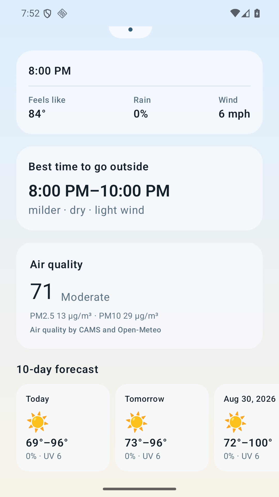
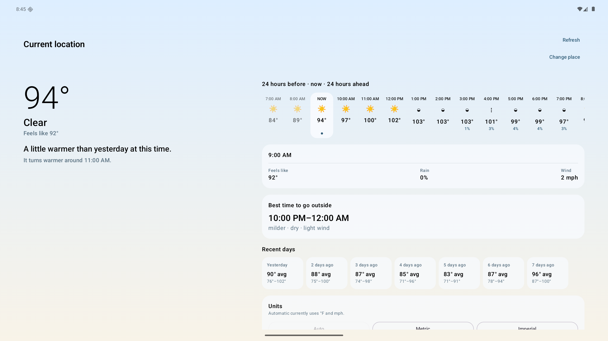
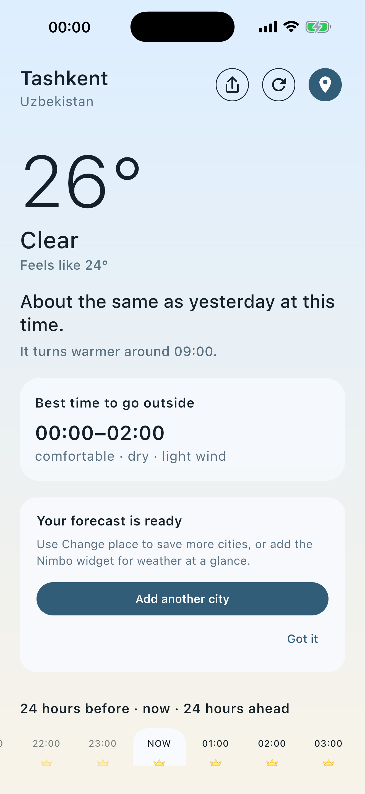
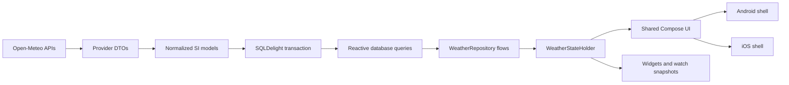

# Nimbo

[](https://github.com/4810092/Weather/actions/workflows/ci.yml)
[](gradle/libs.versions.toml)
[](#platforms-and-release-state)
[](https://github.com/4810092/Weather/releases)
[](LICENSE)

Nimbo is a production Kotlin Multiplatform weather application for Android and iOS. It is also an inspectable reference codebase for shared Compose Multiplatform UI, SQLDelight-backed offline data, deterministic weather insights, localization and RTL, adaptive layouts, accessibility, and real mobile release constraints.

**Website:** [nimbo.uz](https://nimbo.uz) is live on GitHub Pages. Cloudflare
delegation, HTTPS, redirects, canonicals, and the localized routes pass the
dated [domain launch checks](growth/quality/domain-launch-2026-08-28.md).

This repository contains an application, not a framework or reusable weather SDK. The value is in studying a complete product and its trade-offs: platform shells, shared UI and state, provider normalization, database migrations, widgets and watch companions, privacy boundaries, CI, store metadata, and release evidence all live together.

**Stack:** Kotlin Multiplatform, Compose Multiplatform, Coroutines/StateFlow, Ktor, kotlinx.serialization, kotlinx-datetime, SQLDelight, Android/WorkManager, UIKit/SwiftUI/WidgetKit, watchOS, and Wear OS.

## Screenshots

These are checked-in captures from the implemented application UI, not design mockups.

| Android phone | Android tablet | iPhone |
| --- | --- | --- |
|  |  |  |

The versioned [store screenshot set](store/screenshots/) also covers localized Android phones, iPhone, iPad, Wear OS, and Apple Watch surfaces. Dark appearance is implemented and contrast-tested, but a dedicated dark screenshot is not currently part of the committed store set.

## Why this repository exists

Many KMP examples stop at a network call and a shared model. Nimbo keeps the parts that become important when an application must survive offline use, platform permission differences, schema evolution, localization, accessibility review, app-store packaging, and upgrades from an existing Android application ID.

The repository is intended to be useful when evaluating or implementing:

- how much UI and presentation state to share between Android and iOS;
- how to keep a local database as the UI source of truth;
- where provider DTOs, normalized SI models, display units, and localized text should meet;
- how to keep insight logic deterministic and testable;
- how to preserve chronological meaning inside an RTL interface;
- how to test SQLDelight migrations against a database from a released schema;
- how app, widget, watch, privacy, store, and CI requirements affect architecture.

Nimbo does not claim that these choices are universal best practices. The ADRs record why they fit this application and what they cost.

## Features

- Current, hourly, 10-day, recent-history, and air-quality views.
- A continuous 24-hours-before to 24-hours-ahead timeline.
- Offline cached weather with explicit stale/refresh state.
- Deterministic yesterday comparison, upcoming-change insight, and safety-gated two-hour “Best time outside” recommendation.
- Optional foreground approximate location and manual city search.
- Up to ten saved places, automatic/metric/imperial units, and system/light/dark appearance.
- Android and iOS shared Compose UI, Android home widget, WidgetKit extension, Wear OS companion, and watchOS companion.
- 13 shipped languages including Arabic RTL and Uzbek.
- Adaptive phone/tablet layouts, large-text reflow, screen-reader semantics, and an intentionally left-to-right chronological timeline in RTL locales.
- Localized, user-initiated support and store-rating paths with no incentives,
  sentiment gating, accounts, or tracking parameters.

## Architecture

The `shared` module is a cohesive application module rather than a published library. Platform shells provide lifecycle and platform services; shared code owns provider mapping, persistence, domain logic, presentation state, resources, and most UI.



A refresh maps and validates provider data before opening a transaction. The UI observes SQLDelight query flows; it does not render the network response directly. A failed refresh therefore cannot erase an already usable screen.

See [Architecture](docs/ARCHITECTURE.md), [cache/history ADR](docs/adr/0005-cache-and-history.md), and the reviewable [SQL schema](shared/src/commonMain/sqldelight/uz/ganikhodjaev/weather/db/Weather.sq).

## Patterns demonstrated in Nimbo

| Pattern | Why it is here | Trade-off and code |
| --- | --- | --- |
| Database as UI source of truth | Cached data renders first and remains usable across provider failures. | Requires explicit retention, transactions, and migration ownership. See [WeatherRepository](shared/src/commonMain/kotlin/uz/ganikhodjaev/weather/shared/data/WeatherRepository.kt) and [ADR 0005](docs/adr/0005-cache-and-history.md). |
| Shared UI with narrow platform adapters | Android and iOS share state, resources, theme, and Compose UI while retaining native location, formatting, appearance, and sharing integrations. | Platform conventions still require `expect`/`actual` adapters and Swift/Kotlin shells. See [NimboApp](shared/src/commonMain/kotlin/uz/ganikhodjaev/weather/shared/NimboApp.kt) and [location contract](shared/src/commonMain/kotlin/uz/ganikhodjaev/weather/shared/location/DeviceLocationProvider.kt). |
| Deterministic insight engines | Weather comparisons and outdoor recommendations are explainable, local, and covered by fixed-input tests. | Product thresholds require deliberate review and are general guidance, not safety guarantees. See [insight design](docs/INSIGHT_ENGINE.md) and [engine tests](shared/src/commonTest/kotlin/uz/ganikhodjaev/weather/shared/domain/BestTimeOutsideEngineTest.kt). |
| Privacy boundary before persistence/network | Device coordinates are rounded to two decimals before use by the repository or provider. | Reduced precision can affect small-area forecasts and reverse-geocoded labels. See [coarsening](shared/src/commonMain/kotlin/uz/ganikhodjaev/weather/shared/location/DeviceLocationProvider.kt) and its [test](shared/src/commonTest/kotlin/uz/ganikhodjaev/weather/shared/location/DeviceCoordinatesTest.kt). |
| Location-local time and RTL-safe chronology | Forecasts use the selected place’s IANA timezone; the surrounding UI mirrors for Arabic while the time axis stays past-to-future. | This needs explicit layout-direction boundaries and platform formatters. See [LocalWeatherTime](shared/src/commonMain/kotlin/uz/ganikhodjaev/weather/shared/domain/LocalWeatherTime.kt), [timeline UI](shared/src/commonMain/kotlin/uz/ganikhodjaev/weather/shared/ui/WeatherScreen.kt), and [localization notes](docs/LOCALIZATION.md). |
| Released-schema migration fixture | A generated v1 database is migrated in an Android host test in addition to SQLDelight schema verification. | Every released schema needs a sanitized fixture and an intentional migration. See [ReleasedDatabaseMigrationTest](shared/src/androidHostTest/kotlin/uz/ganikhodjaev/weather/shared/data/ReleasedDatabaseMigrationTest.kt). |

## Project structure

```text
app/       Android phone/tablet shell, WorkManager refresh, and home widget
androidSurfaceContract/  Pure render-state contract shared by the Android widget and Wear OS
shared/    KMP data/domain/presentation code, Compose UI, resources, SQL, and tests
iosApp/    iOS/iPadOS shell, WidgetKit extension, watchOS app, and Xcode project
wearApp/   Wear OS companion application
store/     Versioned store copy, privacy declarations, artwork, and screenshots
growth/    Versioned baseline, rank monitor, KPI gates, reports, and outreach drafts
site/      Uzbek/Russian/English landing, press, support, and privacy source
docs/      Architecture, ADRs, privacy, quality, and release evidence
scripts/   Repository, localization, metadata, and asset validation
```

The single shared Gradle module is intentional for the current codebase; package boundaries carry most of the architectural separation. See [ADR 0003](docs/adr/0003-architecture-state-and-di.md).

## Getting started

No weather API key is required. On first launch, search for a city or choose the optional approximate-location flow.

### Prerequisites

- Git and Python 3.
- JDK 17. The project targets Java 17; CI also verifies the Gradle build on JDK 21.
- Android SDK 36 for Android builds.
- macOS with Xcode 26 or newer for iOS/watchOS builds. Xcode 26.6 is the latest locally verified toolchain.

```sh
git clone https://github.com/4810092/Weather.git
cd Weather
./gradlew :app:assembleDebug
```

The Android APK is written below `app/build/outputs/apk/debug/`. Build the Wear OS companion with:

```sh
./gradlew :wearApp:assembleDebug
```

Build the iOS application and WidgetKit extension for an unsigned simulator destination:

```sh
xcodebuild \
  -project iosApp/Nimbo.xcodeproj \
  -scheme NimboSimulator \
  -configuration Release \
  -sdk iphonesimulator \
  -destination 'generic/platform=iOS Simulator' \
  CODE_SIGNING_ALLOWED=NO \
  ARCHS=arm64 \
  ONLY_ACTIVE_ARCH=YES \
  build
```

The checked-in `NimboSimulator` scheme does not require an Apple developer identity. Device archives use the `Nimbo` scheme and require maintainer-owned signing; contributors do not need those credentials. See [Development](docs/DEVELOPMENT.md) for IDE, Xcode, and common workflow details.

## Quality gates

The pull-request workflow runs repository/secret-hygiene checks, localization parity, store metadata/assets, ktlint, release Android Lint for phone and Wear, shared tests on Android host and iOS Simulator, the released-database migration test, SQLDelight migration verification, R8 Android bundles, an unsigned iOS app/WidgetKit build, and a watchOS Simulator build.

Run the main local gate from a clean tree with:

```sh
python3 scripts/check_repository.py
python3 scripts/verify_release_artifacts.py
python3 scripts/check_release_qa_matrix.py
python3 scripts/check_localizations.py
python3 scripts/check_store_metadata.py
python3 scripts/check_store_assets.py
python3 scripts/check_store_previews.py
python3 scripts/check_dashboard_report.py
python3 scripts/build_site.py --output build/pages-check
python3 scripts/build_site.py --output build/pages-drafts-check --include-drafts
./gradlew clean ktlintCheck \
  :shared:allTests \
  :shared:testAndroidHostTest \
  :shared:iosSimulatorArm64Test \
  :app:testDebugUnitTest \
  :wearApp:testDebugUnitTest \
  :shared:verifySqlDelightMigration \
  :app:lintRelease \
  :wearApp:lintRelease \
  :app:bundleRelease \
  :wearApp:bundleRelease
```

Test counts are discovered from the current tree and reported by Gradle/JUnit
and Python unittest rather than copied into this page. See
[Testing](docs/TESTING.md) for source sets, commands, scope, and known gaps.

## Localization and accessibility

English is canonical. Complete resources ship for Arabic, German, Spanish, French, Hindi, Japanese, Korean, Portuguese, Russian, Turkish, Uzbek, and Simplified Chinese. CI checks resource keys, resource types, positional placeholders, Android widget/Wear strings, and Apple permission/surface strings.

Arabic uses RTL layout, while the chronological forecast row is explicitly LTR so earlier-to-later time does not reverse. Hour items expose localized semantic summaries and selected state; large-font layouts reflow rather than compressing the primary controls. Details and release evidence are in [Localization](docs/LOCALIZATION.md) and [Quality](docs/QUALITY.md).

## Privacy and providers

Nimbo has no account, ads, analytics, crash-reporting SDK, or background location permission. Optional device coordinates are reduced to two decimals before local storage, provider requests, or system reverse geocoding. City queries and reduced coordinates are sent to Open-Meteo over HTTPS; cached places/weather remain on-device, with a compact snapshot shared to widgets and a paired watch.

Read the full [privacy policy](docs/PRIVACY.md), [store privacy declarations](store/privacy-declarations.md), and [provider terms/attribution notes](docs/PROVIDERS.md). OpenMeteo GmbH confirmed in ticket `234272` that Nimbo may use the non-commercial API for the exact free, non-monetized app and unpaid organic-promotion scope [recorded here](growth/legal/open-meteo-clarification-email.md). Monetization, paid promotion, attribution removal, published-limit changes, or another material scope change requires a new provider/licensing decision before proceeding.

## Platforms and release state

- Android phone/tablet `1.0.2` (`versionCode 6`) was rechecked as active in Google Play Production in 177 countries on August 28, 2026.
- iOS/iPadOS `1.0.1` build 4 was rechecked as `Ready for Distribution` in App Store Connect on August 28; its binary includes WidgetKit and Apple Watch. One iOS 1.0.1 crash remains unsymbolicated, so acquisition scaling is blocked.
- Wear OS `1.0.2` (`versionCode 1000007`) was rechecked as active in Google Play Production in 177 countries on August 28. Physical paired-device smoke is still pending.
- The coordinated `1.1.0` source identities are Android phone 8, Wear 1000008,
  and Apple build 6; nothing is uploaded or public. No retained signed artifact
  is source-current: signed phone vc7, signed Wear vc1000008, and Apple build 5
  all embed or represent historical source. The predecessor `9c2dce4` phone and
  Wear outputs are unsigned, while its Apple build 6 is simulator-only; current
  source `65b2eb9` has no retained signed candidate bytes. Historical QA
  does not establish signing or physical coverage for the current candidates.
  Current product/build source `65b2eb9` keeps the Apple source-revision and
  deterministic per-target profile plumbing, pins the complete Android and
  `iosArm64` dependency graph, and seals actual source bytes in the hosted
  candidate workflow; prior unsigned and device evidence is non-transferable.
  See the [growth
  implementation checkpoint](docs/GROWTH_RELEASE.md), the
  [source-sync gate](growth/quality/release-artifact-source-sync-2026-08-30-65b2eb9.md),
  and the historical [release candidate record](docs/RELEASE_CANDIDATE.md).
- GitHub tags `v1.0.0-rc.1` and `v1.0.0-rc.2` are prerelease checkpoints. They are not presented as production releases.

Store consoles remain the authority for live availability. The repository records the evidence known at each checkpoint rather than silently rewriting historical status.

## Contributing and support

Focused bug fixes, provider robustness, tests, accessibility improvements, documentation, localization corrections, and justified platform-parity work are welcome. A new issue is helpful for larger behavior changes but is not required for a small, self-contained correction.

Start with [Contributing](CONTRIBUTING.md), [Development](docs/DEVELOPMENT.md), and [Support](SUPPORT.md). Please report vulnerabilities privately as described in [Security](SECURITY.md).

Good first contribution areas include:

- deterministic edge-case tests for timezones, partial provider payloads, and insight thresholds;
- accessibility labels, focus behavior, contrast, and large-text verification;
- documentation corrections that link claims to implementation;
- localization corrections that preserve placeholders and meaning;
- parity checks for widget/watch surfaces;
- provider failure handling and sanitized test fixtures.

These are contribution categories, not manufactured “good first issue” claims. Check existing issues or start a discussion before investing in a large change.

## Roadmap

Near-term maintainer priorities are intentionally modest: strengthen state-holder and provider integration tests, complete physical-device accessibility/parity checks, keep provider/privacy declarations current, and document future release checkpoints. See the dated [roadmap](docs/ROADMAP.md). It is a direction, not a promise of scope or schedule.

## License

Nimbo is licensed under [Apache License 2.0](LICENSE). Weather and place data have separate attribution and deployment terms documented in [Providers](docs/PROVIDERS.md).
