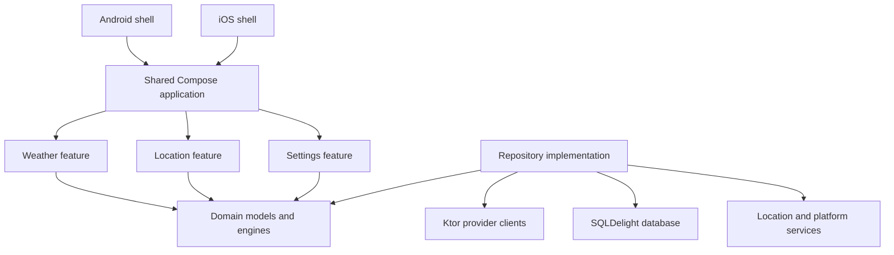

# Architecture

Nimbo uses pragmatic Clean Architecture with Kotlin Multiplatform modules and shared Compose UI. Dependencies point from platform shells and features toward domain contracts, never from domain into platform code.

## Boundaries

- Domain models use normalized SI values and `Instant` plus location timezone identifiers. Formatting and conversion happen at presentation boundaries.
- Provider DTOs and database rows never enter UI state.
- Repositories expose cached streams as the source of truth. Refresh writes normalized data and forecast snapshots transactionally.
- Platform APIs are narrow interfaces for foreground location, locale/region, network reachability hints, and app settings links.
- State holders expose immutable `StateFlow<UiState>` and accept explicit actions. One-off effects are limited to platform launches and permission requests.

## Implemented modules

- `shared`: normalized models, deterministic domain engines, Ktor provider clients, SQLDelight persistence, state holder, localized Compose UI, and platform contracts/implementations.
- `app`: thin Android application shell. It owns the immutable production application ID and release packaging.
- `iosApp`: thin UIKit/Swift shell embedding the shared Compose controller. It owns the bundle identifier and Apple packaging/signing configuration.

Nimbo intentionally keeps one cohesive shared module for v1. Package boundaries enforce the layers without creating premature Gradle modules. Extraction is justified only when build performance or independent ownership requires it.
