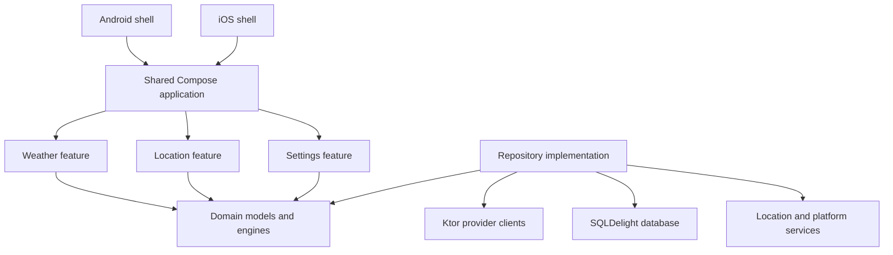

# Architecture

Nimbo uses pragmatic Clean Architecture with Kotlin Multiplatform modules and shared Compose UI. Dependencies point from platform shells and features toward domain contracts, never from domain into platform code.

## Boundaries

- Domain models use normalized SI values and `Instant` plus location timezone identifiers. Formatting and conversion happen at presentation boundaries.
- Provider DTOs and database rows never enter UI state.
- Repositories expose cached streams as the source of truth. Refresh writes normalized data and forecast snapshots transactionally.
- Platform APIs are narrow interfaces for foreground location, locale/region, network reachability hints, and app settings links.
- State holders expose immutable `StateFlow<UiState>` and accept explicit actions. One-off effects are limited to platform launches and permission requests.

## Initial module direction

- `composeApp`: Android application, iOS framework, shared root UI and navigation.
- `core:model`: normalized models and value types.
- `core:domain`: insight, comparison, unit, timezone, and outdoor-comfort rules.
- `core:data`: repository, Ktor clients, SQLDelight persistence, cache policy, snapshots.
- `core:designsystem`: tokens and shared visual components.
- `feature:weather`, `feature:location`, `feature:settings`: presentation and Compose UI.
- `iosApp`: thin UIKit/Swift entry point embedding the shared Compose controller.

The first implementation milestone is a real vertical slice before further module extraction.

