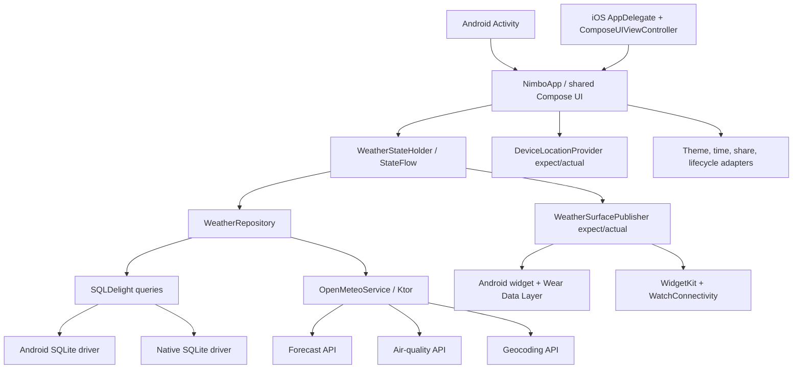
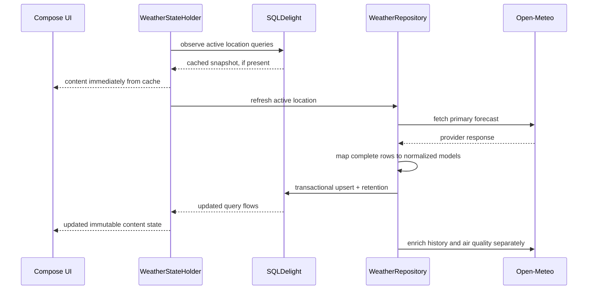

# Architecture

Nimbo is a Kotlin Multiplatform application with shared Compose Multiplatform UI. It uses one cohesive `shared` module plus thin platform and companion modules. This is a pragmatic application architecture, not a framework API or a claim that one shared module fits every KMP project.

## Runtime map

The composition root is [NimboContainer](../shared/src/commonMain/kotlin/uz/ganikhodjaev/weather/shared/NimboContainer.kt). Manual construction keeps the current dependency graph visible; [ADR 0003](adr/0003-architecture-state-and-di.md) explains why no DI framework is used yet.

## Data flow and offline behavior

[WeatherRepository](../shared/src/commonMain/kotlin/uz/ganikhodjaev/weather/shared/data/WeatherRepository.kt) maps a provider payload before opening a transaction and rejects a response with no complete required hourly row. It writes hourly data and forecast snapshots together, then applies bounded retention. [WeatherStateHolder](../shared/src/commonMain/kotlin/uz/ganikhodjaev/weather/shared/presentation/WeatherStateHolder.kt) observes database flows and marks cached content as refreshing; a network error keeps the content and exposes a semantic refresh message.

Primary current/hourly work commits before seven-day history and air-quality enrichment are launched. The first useful screen is therefore not gated on secondary calls. The precise retention and snapshot policy is recorded in [ADR 0005](adr/0005-cache-and-history.md).

## Boundaries

### Data

- [OpenMeteoDtos](../shared/src/commonMain/kotlin/uz/ganikhodjaev/weather/shared/data/OpenMeteoDtos.kt) match external payloads and stay internal to the data package.
- [WeatherModels](../shared/src/commonMain/kotlin/uz/ganikhodjaev/weather/shared/model/WeatherModels.kt) hold normalized application models. Temperature, wind, and precipitation remain in SI values until presentation.
- [Weather.sq](../shared/src/commonMain/sqldelight/uz/ganikhodjaev/weather/db/Weather.sq) is explicit, reviewable persistence. Database rows are mapped before they reach state/UI.
- [OpenMeteoService](../shared/src/commonMain/kotlin/uz/ganikhodjaev/weather/shared/data/OpenMeteoService.kt) owns endpoints, timeouts, bounded retries, JSON decoding, and localized city-search fallback.

### Domain

- [WeatherInsightEngine](../shared/src/commonMain/kotlin/uz/ganikhodjaev/weather/shared/domain/WeatherInsightEngine.kt) compares current weather with the nearest local-time value one day earlier and scans for upcoming changes.
- [BestTimeOutsideEngine](../shared/src/commonMain/kotlin/uz/ganikhodjaev/weather/shared/domain/BestTimeOutsideEngine.kt) scores complete two-hour windows and excludes explicit hazards.
- [LocalWeatherTime](../shared/src/commonMain/kotlin/uz/ganikhodjaev/weather/shared/domain/LocalWeatherTime.kt) applies the selected location’s IANA timezone and calendar-day semantics across DST.

The engines return semantic values rather than localized prose. Their thresholds are product choices documented in [INSIGHT_ENGINE.md](INSIGHT_ENGINE.md), not safety guarantees.

### Presentation and UI

[WeatherStateHolder](../shared/src/commonMain/kotlin/uz/ganikhodjaev/weather/shared/presentation/WeatherStateHolder.kt) exposes an immutable `StateFlow<WeatherUiState>` and explicit actions. [WeatherScreen](../shared/src/commonMain/kotlin/uz/ganikhodjaev/weather/shared/ui/WeatherScreen.kt) renders location selection, loading/error, cached/refresh, timeline, insight, settings, air-quality, and daily sections.

The UI is shared, but platform conventions are not erased. `expect`/`actual` adapters cover:

- foreground location and reverse geocoding;
- SQLite and Ktor engines;
- local time formatting and automatic unit selection;
- theme preference integration and current foreground state;
- platform share sheets;
- widget/watch snapshot publication.

This keeps platform code narrow while accepting the cost of parallel implementations and platform testing.

## Privacy boundary

The optional device-location result is rounded to two decimals in common code before the `Location` enters persistence, provider requests, or reverse geocoding. The boundary is visible in [DeviceLocationProvider.kt](../shared/src/commonMain/kotlin/uz/ganikhodjaev/weather/shared/location/DeviceLocationProvider.kt) and enforced by [DeviceCoordinatesTest](../shared/src/commonTest/kotlin/uz/ganikhodjaev/weather/shared/location/DeviceCoordinatesTest.kt).

The application does perform scheduled weather refreshes for the already stored coarse location. It does not request background location or reacquire device coordinates in the background. See [PRIVACY.md](PRIVACY.md).

## Persistence and migrations

SQLDelight owns locations, hourly weather, forecast snapshots, daily forecasts, air quality, and settings. Migration verification has two layers:

1. `:shared:verifySqlDelightMigration` checks numbered migrations against versioned schema material.
2. [ReleasedDatabaseMigrationTest](../shared/src/androidHostTest/kotlin/uz/ganikhodjaev/weather/shared/data/ReleasedDatabaseMigrationTest.kt) copies a sanitized v1 SQLite fixture, applies migrations through the Android driver, and verifies retained data/new tables.

The fixture is release evidence, not sample user data. It contains generated weather/location values and no user identity.

## Modules and ownership

| Path | Responsibility |
| --- | --- |
| `androidSurfaceContract/` | Pure cache-validation and Empty/Fresh/Stale render contract compiled and tested by both Android widget surfaces. |
| `shared/` | Common models, provider client, repository, SQLDelight, domain engines, state, resources, shared Compose UI, and Android/iOS adapters. |
| `app/` | Android phone/tablet entry point, background refresh scheduling, home widget, Wear data publication, packaging, and immutable app ID. |
| `iosApp/` | UIKit entry point, shared Compose controller, background refresh registration, the shared Apple Empty/Fresh/Stale surface contract, WidgetKit, watchOS, Xcode schemes, bundle IDs, and signing configuration. |
| `wearApp/` | Phone-dependent Wear OS surface receiving the latest compact snapshot. |
| `store/` | Version-controlled listing inputs, privacy declarations, artwork, and validated screenshots. |

Separate feature Gradle modules are deliberately deferred. They would add configuration and framework boundaries without current independent ownership or build-performance evidence. Package boundaries should remain disciplined; module extraction can be reconsidered when there is a measured reason.

## Architecture decisions

- [ADR 0001: Weather and geocoding provider](adr/0001-weather-and-geocoding-provider.md)
- [ADR 0002: SQLDelight persistence](adr/0002-database.md)
- [ADR 0003: Shared UI, UDF, and manual dependency injection](adr/0003-architecture-state-and-di.md)
- [ADR 0004: Platform and toolchain baseline](adr/0004-platform-versions.md)
- [ADR 0005: Cache, refresh, and forecast history](adr/0005-cache-and-history.md)

An ADR describes a decision at a point in time. If implementation and an ADR diverge, update the ADR or add a superseding one in the same change.
